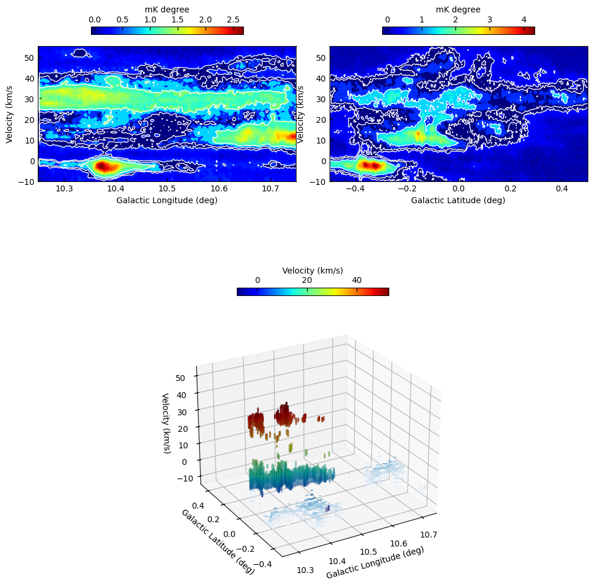
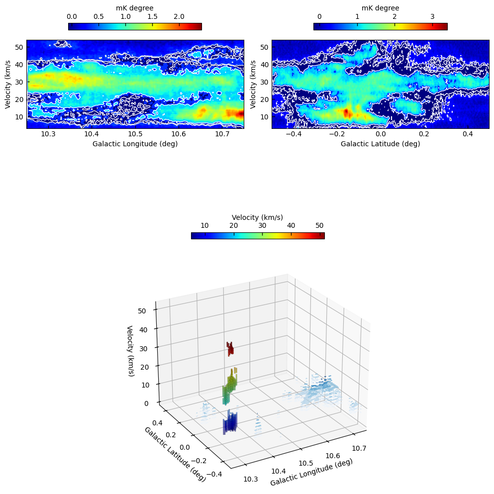
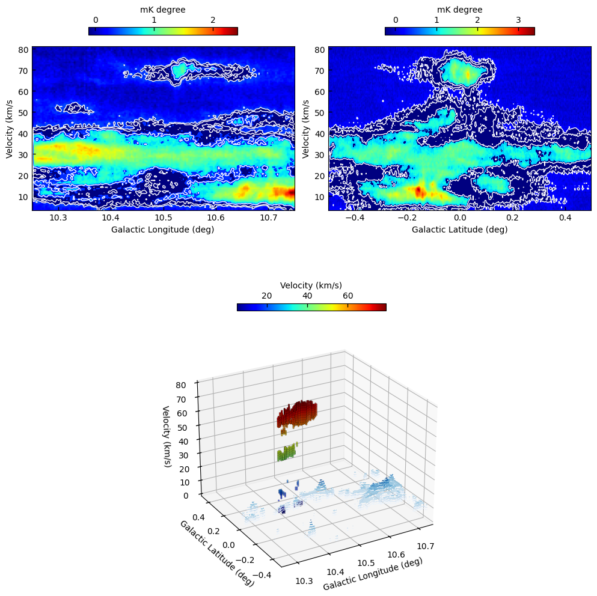
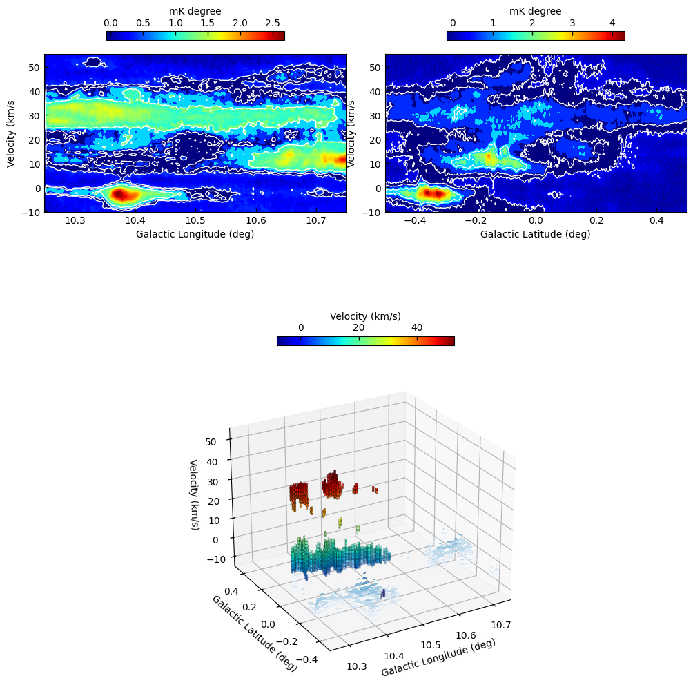
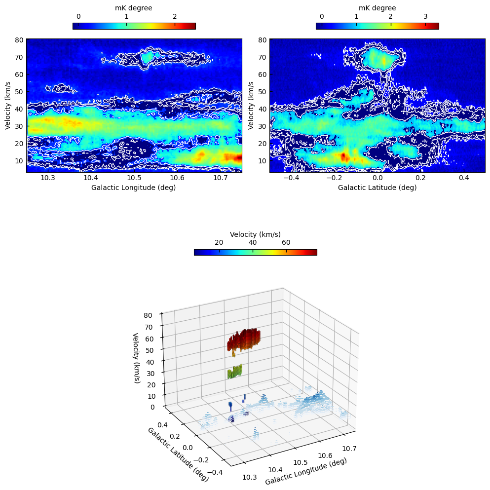

# FIGURES 3D POUR VISU

## Clustering ClusteringDBSCAN, distance DistanceEuclieanEx

### Fichier de configuration (config_clustering2.yaml)

```yaml
  threshold: 2.4
  speed_threshold: 15.0
  min_len_souspic: 4
  data3D_path: "../../../BIGSF_DATA/Clustering_COHRS/COHRS_10p50_0p00_CUBE_3T2_R2.fit"
  data3D_reprojected_path : "../../../BIGSF_DATA/Clustering_COHRS/COHRS_reprojected_10p50_0p00_CUBE_3T2_R2.fit"
  mask_toreproject_data_path: "../../../BIGSF_DATA/Clustering_COHRS/new_full_mask_002011.fits"
  clustered_data_folder: "../../../BIGSF_DATA/Clustering_COHRS/data_test"
  skeleton_tool: 
    type : SkeletonFilFinder
  distance: 
    type : DistanceEuclieanExp
    speed_threshold: 15.0
  clustering_method: 
    type : ClusteringDBSCAN
    eps : 2.0
    min_samples : 7
  denoising_method: 
    type : NoDenoising
  modes : ["3d_skeletons", "2d_skeletons", "all_3d_skeletons"]
```

---

### FIGURES

- [Cube 3D interactif](https://multi-learn.github.io/figures/figure_ske6.html))


## Clustering ClusteringDBSCAN, distance DistanceSpeedExp


### Fichier de configuration (config_clustering3.yaml)

```yaml
  threshold: 2.4
  speed_threshold: 15.0
  min_len_souspic: 4
  data3D_path: "../../../BIGSF_DATA/Clustering_COHRS/COHRS_10p50_0p00_CUBE_3T2_R2.fit"
  data3D_reprojected_path: "../../../BIGSF_DATA/Clustering_COHRS/COHRS_reprojected_10p50_0p00_CUBE_3T2_R2.fit"
  mask_toreproject_data_path: "../../../BIGSF_DATA/Clustering_COHRS/new_full_mask_002011.fits"
  clustered_data_folder: "../../../BIGSF_DATA/Clustering_COHRS/data_test3"
  skeleton_tool: 
    type : SkeletonFilFinder
  distance: 
    type : DistanceSpeedExp
    speed_threshold: 15.0
  clustering_method: 
    type : ClusteringDBSCAN
    eps : 2.0
    min_samples : 7
  denoising_method: 
    type : NoDenoising
  modes : ["3d_skeletons", "2d_skeletons", "all_3d_skeletons"]
```
---

### FIGURES

- [Cube 3D interactif skeleton 6](https://multi-learn.github.io/figures/figure3_ske6.html))
- [Cube 3D interactif skeleton 7](https://multi-learn.github.io/figures/figure3_ske7.html))
- [Cube 3D interactif skeleton 12](https://multi-learn.github.io/figures/figure3_ske12.html))


## Clustering ClusteringDBSCAN, distance DistanceSpeedExp


### Fichier de configuration (config_clustering4.yaml)

```yaml
threshold: 1.8
speed_threshold: 15.0
min_len_souspic: 4
data3D_path: "../../../BIGSF_DATA/Clustering_COHRS/COHRS_10p50_0p00_CUBE_3T2_R2.fit"
data3D_reprojected_path : "../../../BIGSF_DATA/Clustering_COHRS/COHRS_reprojected_10p50_0p00_CUBE_3T2_R2.fit"
mask_toreproject_data_path: "../../../BIGSF_DATA/Clustering_COHRS/new_full_mask_002011.fits"
clustered_data_folder: "../../../BIGSF_DATA/Clustering_COHRS/data_test4"
skeleton_tool: 
  type : SkeletonFilFinder
distance: 
  type : DistanceSpeedExp
  speed_threshold: 15.0
clustering_method: 
  type : ClusteringDBSCAN
  eps : 2.0
  min_samples : 7
denoising_method: 
  type : NoDenoising
modes : ["3d_skeletons", "2d_skeletons", "all_3d_skeletons"]
```
---

### FIGURES

- [Cube 3D interactif skeleton 6](https://multi-learn.github.io/figures/figure4_ske6.html))
- [Cube 3D interactif skeleton 7](https://multi-learn.github.io/figures/figure4_ske7.html))
- [Cube 3D interactif skeleton 12](https://multi-learn.github.io/figures/figure4_ske12.html))


- i_skeleton = 6
  
 equivalent plotly
 [plotly script Annie skeleton 6](https://multi-learn.github.io/figures/figureannie_ske6.html))



- i_skeleton = 7

 [plotly script Annie skeleton 7](https://multi-learn.github.io/figures/figureannie_ske7.html))
 
 


- i_skeleton = 12

 [plotly script Annie skeleton 12](https://multi-learn.github.io/figures/figureannie_ske12.html))
 
 

## Clustering ClusteringDBSCAN, distance DistanceSpeedExp, subclustering_method:SubClusteringSkimageLabel


### Fichier de configuration (config_clustering5.yaml)

```yaml
 threshold: 1.8
speed_threshold: 15.0
min_len_souspic: 4
data3D_path: "../../../BIGSF_DATA/Clustering_COHRS/COHRS_10p50_0p00_CUBE_3T2_R2.fit"
data3D_reprojected_path : "../../../BIGSF_DATA/Clustering_COHRS/COHRS_reprojected_10p50_0p00_CUBE_3T2_R2.fit"
mask_toreproject_data_path: "../../../BIGSF_DATA/Clustering_COHRS/new_full_mask_002011.fits"
clustered_data_folder: "../../../BIGSF_DATA/Clustering_COHRS/data_test5"
skeleton_tool: 
  type : SkeletonFilFinder
distance: 
  type : DistanceSpeedExp
  speed_threshold: 15.0
clustering_method: 
  type : ClusteringDBSCAN
  eps : 2.0
  min_samples : 7
subclustering_method:
  type : SubClusteringSkimageLabel
  connectivity : 2
  eps : 2.0
  min_samples : 7
denoising_method: 
  type : NoDenoising
modes : ["3d_skeletons", "2d_skeletons", "all_3d_skeletons"]

```
---

### FIGURES  (Experiment 5)

- [Cube 3D interactif skeleton 6](https://multi-learn.github.io/figures/figure5_ske6.html))
- [Cube 3D interactif skeleton 7](https://multi-learn.github.io/figures/figure5_ske7.html))
- [Cube 3D interactif skeleton 12](https://multi-learn.github.io/figures/figure5_ske12.html))

- i_skeleton = 6
  
 equivalent plotly
 [plotly script 5 Annie skeleton 6](https://multi-learn.github.io/figures/figureannie5_ske6.html))



- i_skeleton = 7

 [plotly script Annie skeleton 7](https://multi-learn.github.io/figures/figureannie5_ske7.html))
 
 


- i_skeleton = 12

 [plotly script 5 Annie skeleton 12](https://multi-learn.github.io/figures/figureannie5_ske12.html))
 
 
