# FIGURES 3D POUR VISU

## Clustering ClusteringAgglomerative, distance DistanceSpeed

with mask 2d obtained with Unet 2d segmentation with threshold of 0.5 for binarization

### Fichier de configuration (config_clustering8.yaml)

```yaml
threshold: 2.1
speed_threshold: 15.0
min_len_souspic: 4
data3D_path: "../../../BIGSF_DATA/Clustering_COHRS/COHRS_10p50_0p00_CUBE_3T2_R2.fit"
data3D_reprojected_path : "../../../BIGSF_DATA/Clustering_COHRS/COHRS_reprojected_Unet_fromCut.fits"
mask_toreproject_data_path: "../../../BIGSF_DATA/Clustering_COHRS/Cut.fits"
clustered_data_folder: "../../../BIGSF_DATA/Clustering_COHRS/data_test8"
skeleton_tool: 
  type : SkeletonFilFinder
distance: 
  type : DistanceSpeed
  #speed_threshold: 15.0
  #coefficient_speed : 1.0
clustering_method: 
  type : ClusteringAgglomerative
  #xi : 0.5
  #eps : 1.0
  #min_samples : 7
  distance_threshold: 15.0
denoising_method: 
  type : NoDenoising
modes : ["3d_skeletons", "2d_skeletons", "all_3d_skeletons"]
```

---

### FIGURES
#### Avec variation d'opacite sur les squelettes 3d en fonction de l' intensite correspondante

##### Unet 2D MASK (Obtained with Parameter's Experience 8) 

 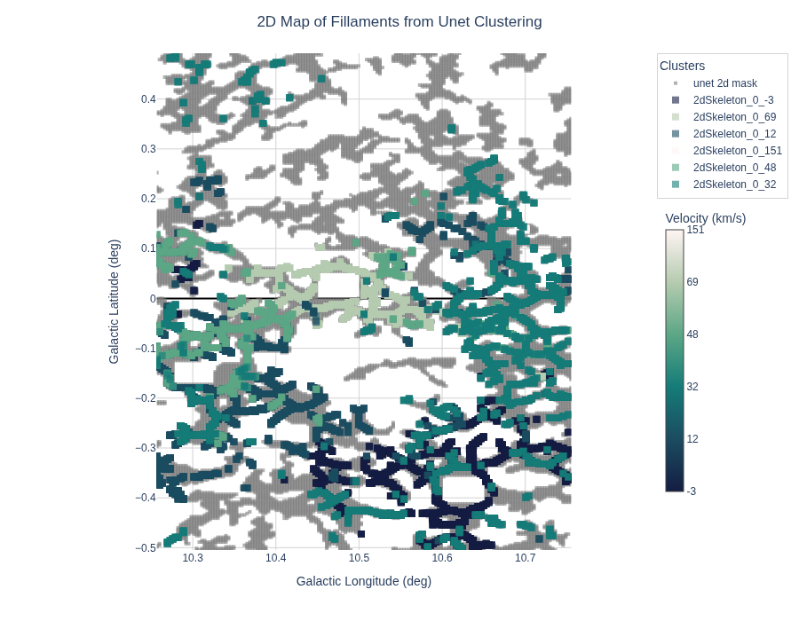
 
- [maskd 2 figure8_ske0  ](https://multi-learn.github.io/figures/d2figure8_ske0.html)


##### Unet 3D Cube plot  (Obtained with Parameter's Experience 8)  

 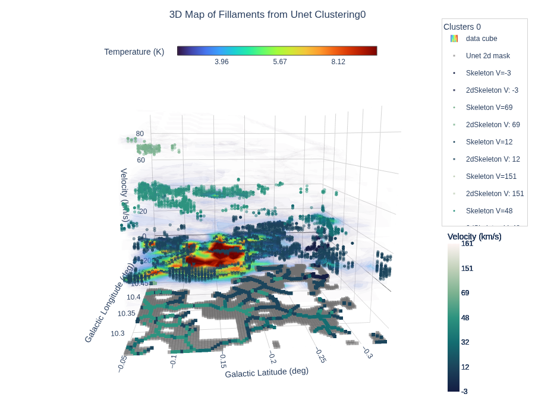
 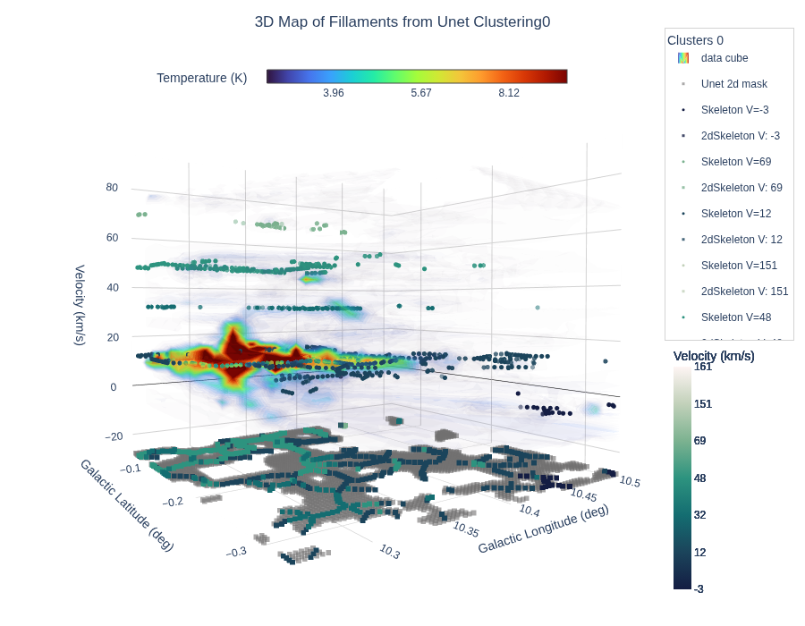
 
 - [volume 3d data plot way 1_ske0 ](https://multi-learn.github.io/figures/figure4volume1_ske0.html)
 - [volume 3d data plot way 1_ske0 zoom in z ](https://multi-learn.github.io/figures/figure8volume1-z60_ske0.html)
 - [volule 3d data way 2 figure8_ske0 zoom in z ](https://multi-learn.github.io/figures/figure4volume2-z60_ske0.html)
 - [volule 3d data way 2 figure8_ske0  ](https://multi-learn.github.io/figures/figure4volume2_ske0.html)
 - [marker 3d data plot 4_ske6  ](https://multi-learn.github.io/figures/figure8opacyty_ske0.html)

##### CLASSICAL 2D MASK  (Obtained with Parameter's Experience 4)
 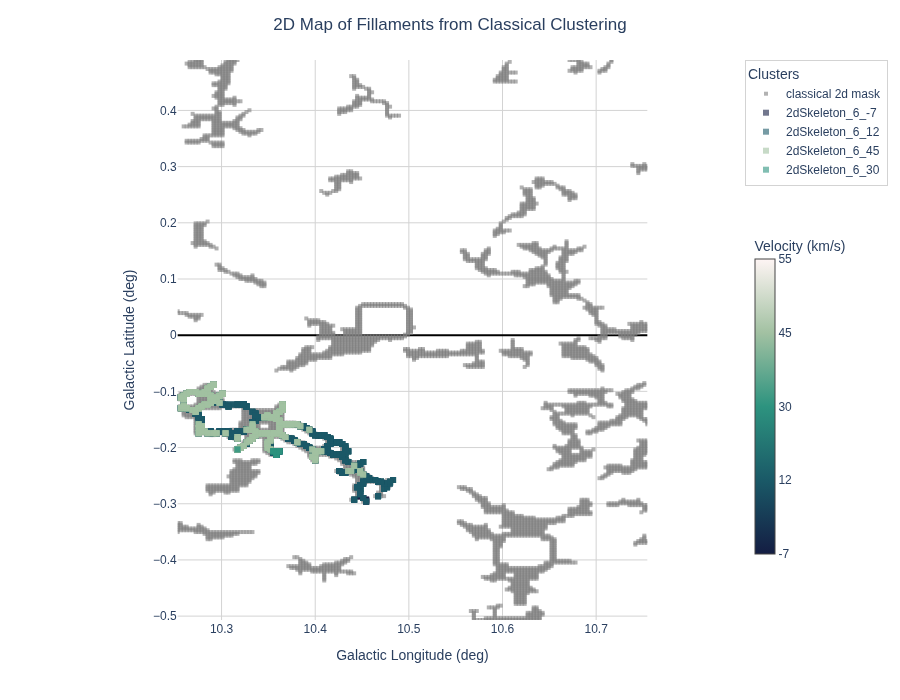

 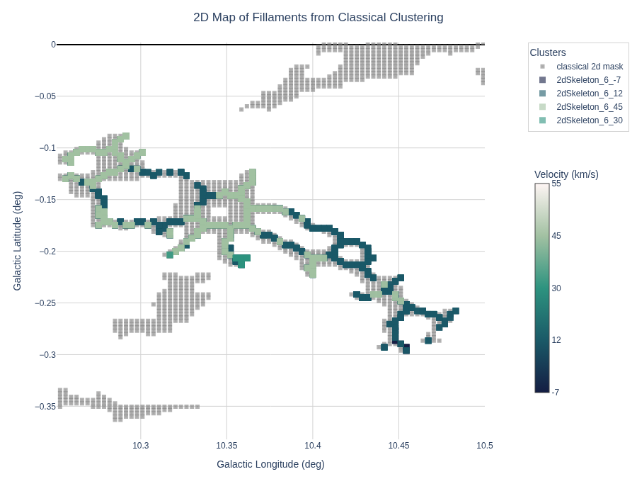 

 - [maskd 2 figure4_ske6  ](https://multi-learn.github.io/figures/d2figure4_ske6.html)
 - [zoom on maskd 2 figure4_ske6  ](https://multi-learn.github.io/figures/d2zoomfigure4_ske6.html)
 - [zoom on 3d maskd figure4_ske6  ](https://multi-learn.github.io/figures/mask3d4_ske6.html)

##### CLASSICAL 3D Cube plot  (Obtained with Parameter's Experience 4)  

 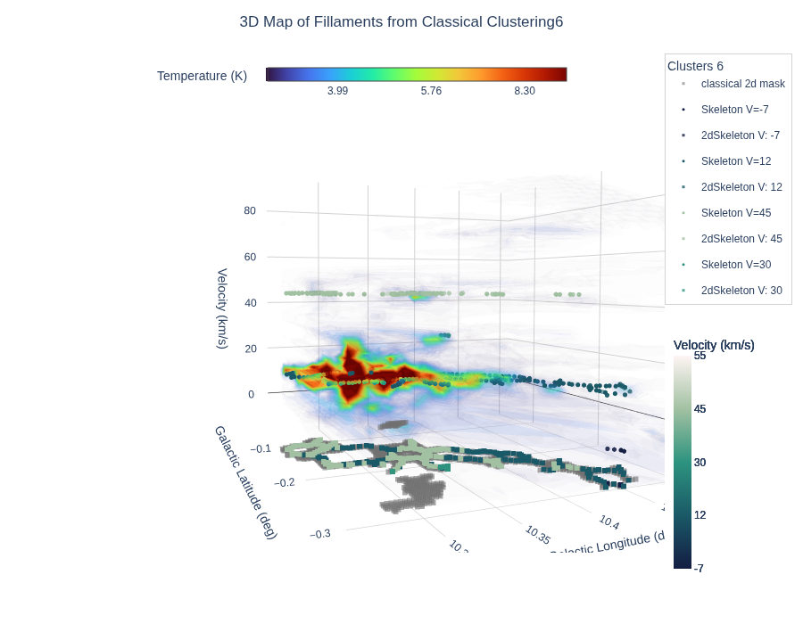
 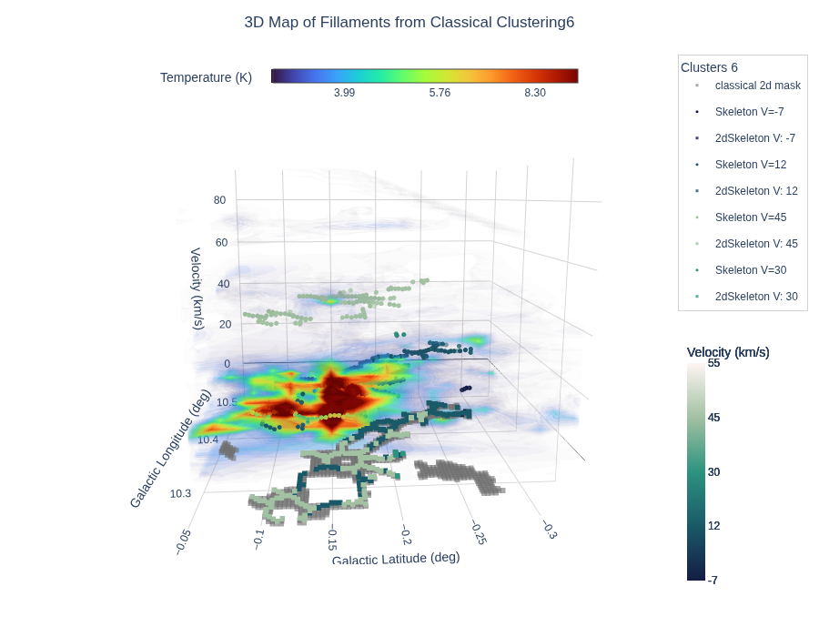
 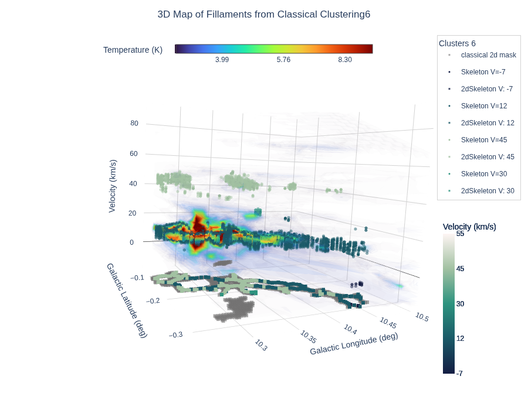
 
 - [volule 3d data way 1figure4_ske6  ](https://multi-learn.github.io/figures/figure4volume_ske6.html)
 - [volume 3d data plot way 2_ske6  ](https://multi-learn.github.io/figures/figure4volume2_ske6.html)
 - [marker 3d data plot 4_ske6  ](https://multi-learn.github.io/figures/figure4opacyty_ske6.html)

## Clustering ClusteringDBSCAN, distance DistanceEuclieanEx

### Fichier de configuration (config_clustering2.yaml)

```yaml
  threshold: 2.4
  speed_threshold: 15.0
  min_len_souspic: 4
  data3D_path: "../../../BIGSF_DATA/Clustering_COHRS/COHRS_10p50_0p00_CUBE_3T2_R2.fit"
  data3D_reprojected_path : "../../../BIGSF_DATA/Clustering_COHRS/COHRS_reprojected_10p50_0p00_CUBE_3T2_R2.fit"
  mask_toreproject_data_path: "../../../BIGSF_DATA/Clustering_COHRS/new_full_mask_002011.fits"
  clustered_data_folder: "../../../BIGSF_DATA/Clustering_COHRS/data_test"
  skeleton_tool: 
    type : SkeletonFilFinder
  distance: 
    type : DistanceEuclieanExp
    speed_threshold: 15.0
  clustering_method: 
    type : ClusteringDBSCAN
    eps : 2.0
    min_samples : 7
  denoising_method: 
    type : NoDenoising
  modes : ["3d_skeletons", "2d_skeletons", "all_3d_skeletons"]
```

---

### FIGURES

- [Cube 3D interactif](https://multi-learn.github.io/figures/figure_ske6.html))


## Clustering ClusteringDBSCAN, distance DistanceSpeedExp


### Fichier de configuration (config_clustering3.yaml)

```yaml
  threshold: 2.4
  speed_threshold: 15.0
  min_len_souspic: 4
  data3D_path: "../../../BIGSF_DATA/Clustering_COHRS/COHRS_10p50_0p00_CUBE_3T2_R2.fit"
  data3D_reprojected_path: "../../../BIGSF_DATA/Clustering_COHRS/COHRS_reprojected_10p50_0p00_CUBE_3T2_R2.fit"
  mask_toreproject_data_path: "../../../BIGSF_DATA/Clustering_COHRS/new_full_mask_002011.fits"
  clustered_data_folder: "../../../BIGSF_DATA/Clustering_COHRS/data_test3"
  skeleton_tool: 
    type : SkeletonFilFinder
  distance: 
    type : DistanceSpeedExp
    speed_threshold: 15.0
  clustering_method: 
    type : ClusteringDBSCAN
    eps : 2.0
    min_samples : 7
  denoising_method: 
    type : NoDenoising
  modes : ["3d_skeletons", "2d_skeletons", "all_3d_skeletons"]
```
---

### FIGURES

- [Cube 3D interactif skeleton 6](https://multi-learn.github.io/figures/figure3_ske6.html))
- [Cube 3D interactif skeleton 7](https://multi-learn.github.io/figures/figure3_ske7.html))
- [Cube 3D interactif skeleton 12](https://multi-learn.github.io/figures/figure3_ske12.html))


## Clustering ClusteringDBSCAN, distance DistanceSpeedExp


### Fichier de configuration (config_clustering4.yaml)

```yaml
threshold: 1.8
speed_threshold: 15.0
min_len_souspic: 4
data3D_path: "../../../BIGSF_DATA/Clustering_COHRS/COHRS_10p50_0p00_CUBE_3T2_R2.fit"
data3D_reprojected_path : "../../../BIGSF_DATA/Clustering_COHRS/COHRS_reprojected_10p50_0p00_CUBE_3T2_R2.fit"
mask_toreproject_data_path: "../../../BIGSF_DATA/Clustering_COHRS/new_full_mask_002011.fits"
clustered_data_folder: "../../../BIGSF_DATA/Clustering_COHRS/data_test4"
skeleton_tool: 
  type : SkeletonFilFinder
distance: 
  type : DistanceSpeedExp
  speed_threshold: 15.0
clustering_method: 
  type : ClusteringDBSCAN
  eps : 2.0
  min_samples : 7
denoising_method: 
  type : NoDenoising
modes : ["3d_skeletons", "2d_skeletons", "all_3d_skeletons"]
```
---

### FIGURES

#### Avec variation d'opacite sur les squelettes 3d en fonction de l' intensite correspondante

- [Cube 3D 4 with opacity and grid interactif skeleton 6](https://multi-learn.github.io/figures/figure4bis_ske6.html))
- [Cube 3D interactif skeleton 7](https://multi-learn.github.io/figures/figure4bis_ske7.html))
- [Cube 3D interactif skeleton 12](https://multi-learn.github.io/figures/figure4bis_ske12.html))

#### Avec reafectation des doublons en xy en label sur le nuage le plus petit  + opacity varition
enleve la supreposition des squelettes e par label en 2d mais c'est tres arbitraire

- [Cube 3D interactif skeleton 6](https://multi-learn.github.io/figures/figure4ter_ske6.html))
- [Cube 3D interactif skeleton 7](https://multi-learn.github.io/figures/figure4ter_ske7.html))
- [Cube 3D interactif skeleton 12](https://multi-learn.github.io/figures/figure4ter_ske12.html)) 

#### formule initiale

- [Cube 3D interactif skeleton 6](https://multi-learn.github.io/figures/figure4_ske6.html))
- [Cube 3D interactif skeleton 7](https://multi-learn.github.io/figures/figure4_ske7.html))
- [Cube 3D interactif skeleton 12](https://multi-learn.github.io/figures/figure4_ske12.html))


- i_skeleton = 6
  
 equivalent plotly
 [plotly script Annie skeleton 6](https://multi-learn.github.io/figures/figureannie_ske6.html))

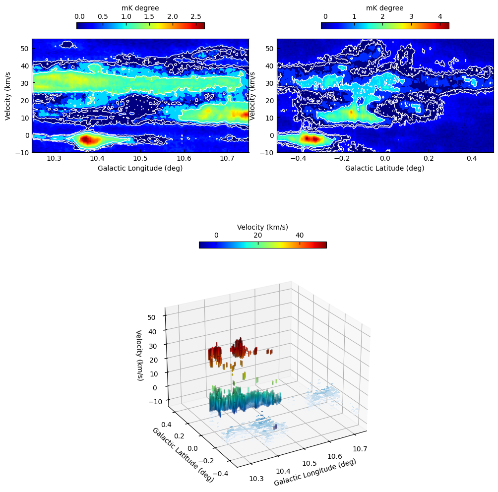

- i_skeleton = 7

 [plotly script Annie skeleton 7](https://multi-learn.github.io/figures/figureannie_ske7.html))
 
 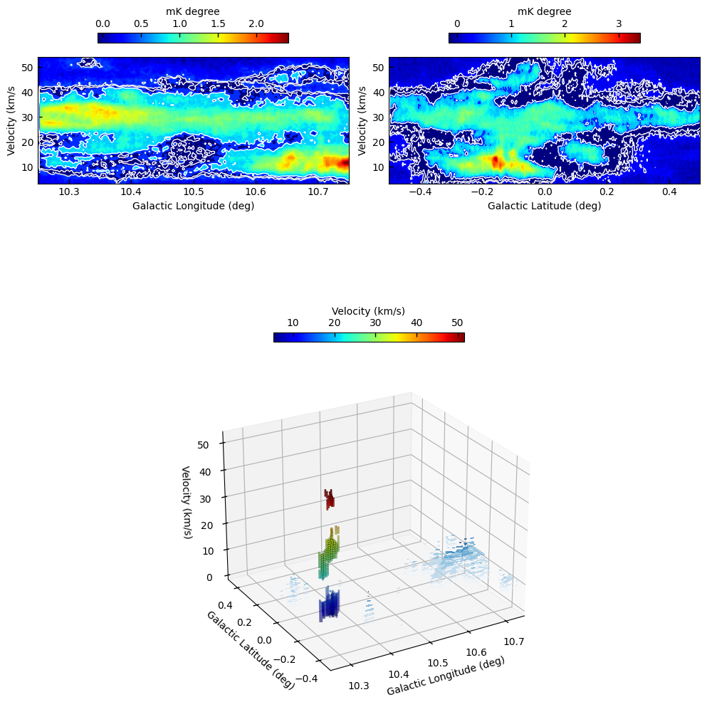


- i_skeleton = 12

 [plotly script Annie skeleton 12](https://multi-learn.github.io/figures/figureannie_ske12.html))
 
 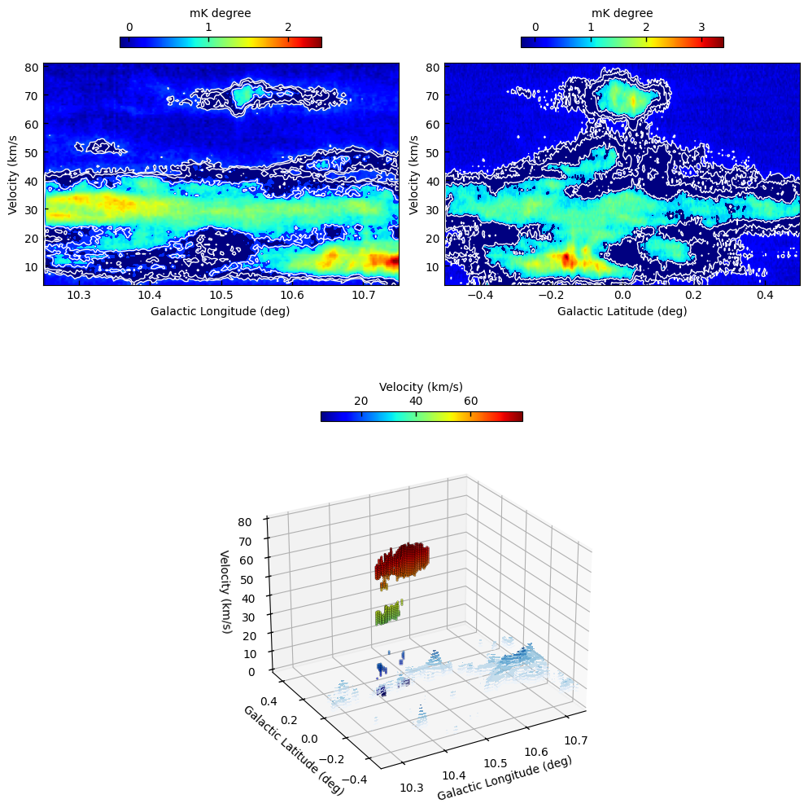

## Clustering ClusteringDBSCAN, distance DistanceSpeedExp, subclustering_method:SubClusteringSkimageLabel


### Fichier de configuration (config_clustering5.yaml)

```yaml
 threshold: 1.8
speed_threshold: 15.0
min_len_souspic: 4
data3D_path: "../../../BIGSF_DATA/Clustering_COHRS/COHRS_10p50_0p00_CUBE_3T2_R2.fit"
data3D_reprojected_path : "../../../BIGSF_DATA/Clustering_COHRS/COHRS_reprojected_10p50_0p00_CUBE_3T2_R2.fit"
mask_toreproject_data_path: "../../../BIGSF_DATA/Clustering_COHRS/new_full_mask_002011.fits"
clustered_data_folder: "../../../BIGSF_DATA/Clustering_COHRS/data_test5"
skeleton_tool: 
  type : SkeletonFilFinder
distance: 
  type : DistanceSpeedExp
  speed_threshold: 15.0
clustering_method: 
  type : ClusteringDBSCAN
  eps : 2.0
  min_samples : 7
subclustering_method:
  type : SubClusteringSkimageLabel
  connectivity : 2
  eps : 2.0
  min_samples : 7
denoising_method: 
  type : NoDenoising
modes : ["3d_skeletons", "2d_skeletons", "all_3d_skeletons"]

```
---

### FIGURES  (Experiment 5)

- [Cube 3D interactif skeleton 6](https://multi-learn.github.io/figures/figure5_ske6.html))
- [Cube 3D interactif skeleton 7](https://multi-learn.github.io/figures/figure5_ske7.html))
- [Cube 3D interactif skeleton 12](https://multi-learn.github.io/figures/figure5_ske12.html))

- i_skeleton = 6
  
 equivalent plotly
 [plotly script 5 Annie skeleton 6](https://multi-learn.github.io/figures/figureannie5_ske6.html))

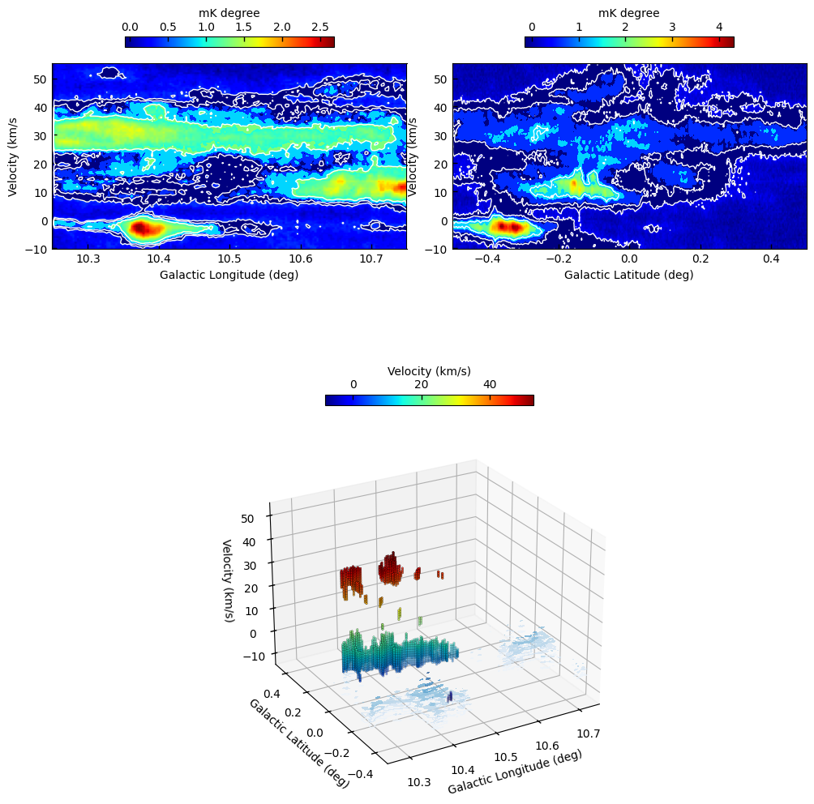

- i_skeleton = 7

 [plotly script Annie skeleton 7](https://multi-learn.github.io/figures/figureannie5_ske7.html))
 
 


- i_skeleton = 12

 [plotly script 5 Annie skeleton 12](https://multi-learn.github.io/figures/figureannie5_ske12.html))
 
 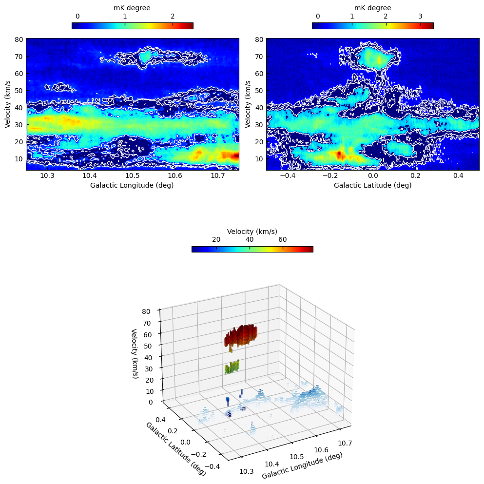
